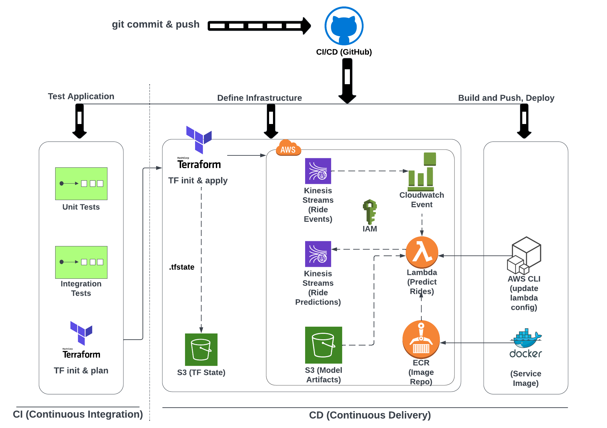

---
[](#)
[](#)
[](#)
[](#)
[](#)
[](#)
[](#)
[](#)
[](#)
[](#)
[](#)
[](#)

---


<p align="center">
  
</p>


```bash
    docker build -t stream-model-duration:v2 .
```

```bash
docker run -it --rm -p ride-duration-prediction-service:v2
```

```bash
docker run -it --rm \
  -p 8080:8080 \
  -e PREDICTIONS_STREAM_NAME="ride_predictions" \
  -e TEST_RUN="True" \
  stream-model-duration:v2
```

```bash
docker run -d -it --rm \
  -p 8080:8080 \
  -e PREDICTIONS_STREAM_NAME="ride_predictions" \
  -e MODEL_LOCATION="/app/model" \
  -e TEST_RUN="True" \
  -e RUN_ID="Test123" \
  -v $(pwd)/model:/app/model \
  stream-model-duration:v2
```

```bash
aws --endpoint-url=http://localhost:4566  kinesis list-streams
{
    "StreamNames": []
}
```

```bash
aws --endpoint-url=http://localhost:4566 \
 kinesis create-stream \
 --stream-name ride_predictions \
 --shard-count 1

```

```bash
aws --endpoint-url=http://localhost:4566 kinesis delete-stream --stream-name ride_predictions
```

```bash

PREDICTION_STREAM_NAME='ride_predictions'
SHARD='shardId-000000000000'

SHARD_ITERATOR=$(aws kinesis \
    get-shard-iterator \
        --shard-id ${SHARD} \
        --shard-iterator-type TRIM_HORIZON \
        --stream-name ${PREDICTION_STREAM_NAME} \
        --query 'ShardIterator' \
)

RESULT=$(aws kinesis get-records --shard-iterator $SHARD_ITERATOR)

echo ${RESULT} | jq -r '.Records[0].Data' | base64 --decode
```

```bash
aws --endpoint-url http://localhost:4566 kinesis describe-stream \
    --stream-name ride_predictions \
    --query "StreamDescription.Shards[*].ShardId" \
    --output text

```

```bash
export SHARD='shardId-000000000000'
export PREDICTION_STREAM_NAME='ride_predictions'
```

```bash
aws --endpoint-url http://localhost:4566 kinesis get-shard-iterator \
    --shard-id ${SHARD} \
    --shard-iterator-type TRIM_HORIZON \
    --stream-name ${PREDICTION_STREAM_NAME} \
    --query 'ShardIterator'

```

```bash
"AAAAAAAAAAEW4iLdPkg0vYVepmNWBc3SuiKea+nVqru0m6S0Hxj3m1WzoOm+6wlz+E7YIWWFZA/6O/wu/VMki7WIpnrnrCoclmOU2cOyiV7pe9oW5WLUEn3TCYbjc46cWw5c3nuDJ9fDahfy9kiu/5PDNMyFL1MGxgQDsvMZ+f8R8JIT/DV5exwKA4feaahl5fc0HmNMSOYw9fb0+hOZZ/YHYfu424Xe"
```

```bash
aws --endpoint-url http://localhost:4566 kinesis get-records --shard-iterator "AAAAAAAAAAEW4iLdPkg0vYVepmNWBc3SuiKea+nVqru0m6S0Hxj3m1WzoOm+6wlz+E7YIWWFZA/6O/wu/VMki7WIpnrnrCoclmOU2cOyiV7pe9oW5WLUEn3TCYbjc46cWw5c3nuDJ9fDahfy9kiu/5PDNMyFL1MGxgQDsvMZ+f8R8JIT/DV5exwKA4feaahl5fc0HmNMSOYw9fb0+hOZZ/YHYfu424Xe"
```

# debug
```bash
# 1. Get shard id
SHARD=$(aws --endpoint-url http://localhost:4566 kinesis describe-stream \
    --stream-name ${PREDICTION_STREAM_NAME} \
    --query "StreamDescription.Shards[0].ShardId" \
    --output text)

# 2. Get shard iterator
ITER=$(aws --endpoint-url http://localhost:4566 kinesis get-shard-iterator \
    --stream-name ${PREDICTION_STREAM_NAME} \
    --shard-id $SHARD \
    --shard-iterator-type TRIM_HORIZON \
    --query 'ShardIterator' \
    --output text)

# 3. Put a record (note the raw-in-base64-out flag)
aws --endpoint-url http://localhost:4566 kinesis put-record \
    --stream-name ${PREDICTION_STREAM_NAME} \
    --partition-key 1 \
    --cli-binary-format raw-in-base64-out \
    --data "Test record"

# 4. Get records
aws --endpoint-url http://localhost:4566 kinesis get-records \
    --shard-iterator $ITER

```

```bash
pylint --recursive=y .
```
```bash
black --diff .
```
To prepare the project run:
```bash
make setup
```

```bash
terraform init
terraform plan
terraform apply
```

```bash
terraform plan -var-file=vars/stg.tfvars
terraform apply -var-file=vars/stg.tfvars
```


```bash
export KINESIS_STREAM_INPUT="stg-ride-events-mlops-zoomcamp"

aws kinesis put-record \
  --stream-name ${KINESIS_STREAM_INPUT} \
  --partition-key 1 \
  --cli-binary-format raw-in-base64-out \
  --data '{
    "ride": {
      "PULocationID": 130,
      "DOLocationID": 205,
      "trip_distance": 3.75
    },
    "ride_id": 006
  }'


  {
    "ShardId": "shardId-000000000001",
    "SequenceNumber": "49666982207866436594932695987844168214195725486316847122"
}
```
Tous